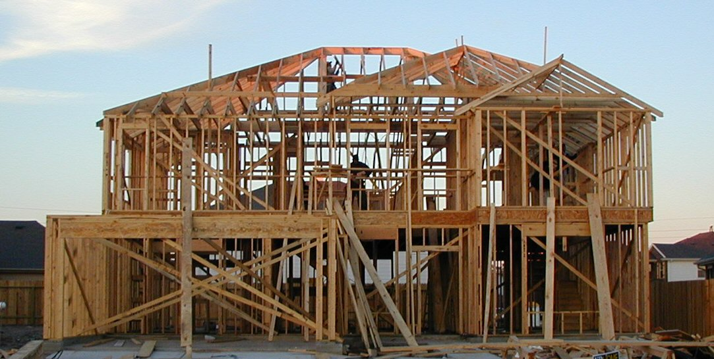
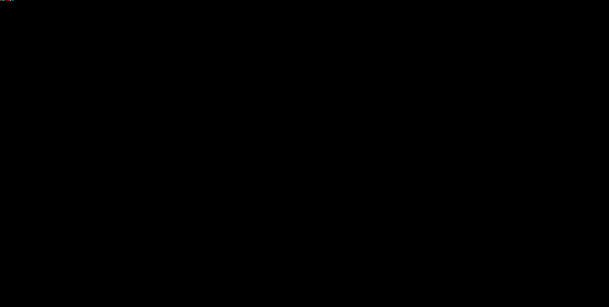
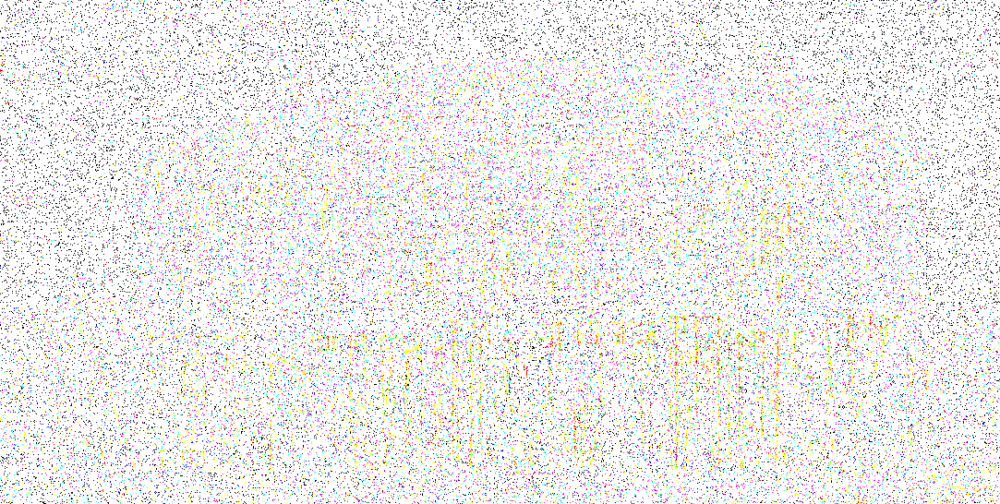
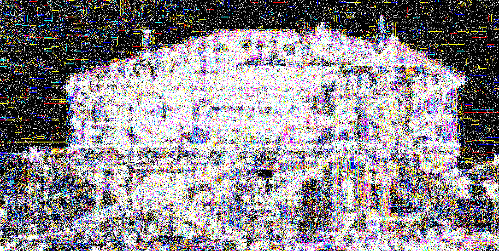

# imgpoison

A small C project that explores image steganography and robust signal embedding.

The project implements LSB and Spread Spectrum steganography, with PNG and JPEG
support, texture-aware embedding, payload redundancy, image analysis and
robustness tests.

| Original | LSB | Spread Spectrum | SS + auto-mask |
|:---:|:---:|:---:|:---:|
|  |  |  |  |
| — | concentrated where the payload is written | low-amplitude, spread across the image | concentrated where the texture mask found high texture |

This is a learning project. The goal is to understand the algorithms by
implementing them directly in C rather than relying on high-level image
processing libraries.

## Why

Studying how hidden payloads survive image processing pipelines.

Can a small signal be hidden inside an image and still be recovered after the
image has been modified?

The experiments focus on JPEG compression, pseudorandom pixel distribution,
signal correlation, redundancy and texture-aware embedding.

JPEG recompression can be handled. Geometric transformations such as rotation
currently break the spatial synchronization between embedding and extraction.

### Noise survives, smoothing kills

The most useful thing measured here is an asymmetry between two attack
families, and it is not close. Additive noise heavy enough to bring the
attacked image down to 8.5dB PSNR still yields a perfectly recovered
payload. Gaussian blur destroys extraction somewhere between sigma 0.9 and
1.1, at an attack PSNR of 21.8dB - roughly 13dB of margin separating the
attack that does nothing from the attack that wins.

This is structural, not a tuning artifact. The pseudorandom permutation
scatters the payload across uncorrelated pixel positions, which puts the
signal in the high spatial frequencies. Noise adds energy there and
correlation averages it away; any low-pass operation removes it and there
is nothing left to correlate against. The practical consequence: the
cheapest effective attack against this scheme costs almost nothing in
perceived image quality.

## Methods

**LSB** — replaces the least significant bit of selected pixels. Simple and
high-capacity, but fragile under JPEG compression and easy to detect.

**Spread Spectrum (SS)** — spreads a weak signal across many pixels using a
seeded pseudorandom sequence. More resistant to compression, but requires a
seed and has lower capacity.

**Texture mask** — weights the Spread Spectrum signal according to local image
structure. Computed from image luminance, Sobel gradients and a structure
tensor. Stronger embedding in textured areas, weaker in flat ones.

**Payload redundancy** — repeats payload bits and uses majority voting during
extraction. Improves robustness at the cost of payload capacity.

## Build

Requires:

    gcc
    zlib
    libjpeg

Build:

    make

The executable is created as:

    bin/imgpoison

PNG support is a small encoder/decoder written directly against zlib, not
libpng.

## Usage

### LSB

Embed:

    ./bin/imgpoison --embed --method lsb \
        --payload "hello" input.png output.png

Extract:

    ./bin/imgpoison --extract --method lsb \
        output.png

### Spread Spectrum

Embed:

    ./bin/imgpoison --embed --method ss --seed 42 --strength 10 \
        --payload "hello" input.png output.jpg

Extract:

    ./bin/imgpoison --extract --method ss --seed 42 \
        output.jpg

SS with an explicit texture mask:

    ./bin/imgpoison --embed --method ss --seed 42 --mask mask.bin \
        --payload "hello" input.png output.jpg

`mask.bin` is a flat binary file of float32 values, one per pixel in raster
order (width*height entries, not width*height*channels), not an image file.

SS with an automatically generated texture mask:

    ./bin/imgpoison --embed --method ss --seed 42 --auto-mask 1.0 \
        --payload "hello" input.png output.jpg

`--auto-mask` takes the gamma value directly as its argument (see Texture
mask below) - it is not a bare flag.

Extraction must use the same mask as embedding. The mask is public - it is
recomputed from the received image, not transmitted with the payload - so
pass the same `--mask`/`--auto-mask` on extract too:

    ./bin/imgpoison --extract --method ss --seed 42 --auto-mask 1.0 \
        output.jpg

SS with a smaller chip size and no payload redundancy - trades robustness
for resolution, see `--chip-size`/`--payload-repeat` below:

    ./bin/imgpoison --embed --method ss --seed 42 --chip-size 64 \
        --payload-repeat 1 --payload "hello" input.png output.jpg

## Parameters

| Parameter          | Default | Description                                              |
|--------------------|---------|-----------------------------------------------------------|
| --seed             | 42      | seed used for embedding and extraction                    |
| --strength         | 10      | signal strength. higher = robust, visible. integer-only   |
| --method           | lsb     | lsb or ss                                                  |
| --mask             |         | explicit texture mask file (flat float32, per pixel)       |
| --auto-mask        |         | generate a texture mask automatically, takes gamma         |
| --chip-size        | 512     | pixels per block. smaller = less robust, finer resolution  |
| --payload-repeat   | 3       | majority-vote redundancy on the payload body, must be odd  |

Defaults are the robust operating point. Lowering `--chip-size`/
`--payload-repeat` (e.g. `--chip-size 64 --payload-repeat 1`) trades that
robustness for enough resolution to see a signal degrade gradually under
attack instead of only seeing whether it survived - used by `--bitacc` and
the sweep tooling in `analysis/`, not normal embed/extract. Must match
between `--embed` and the matching `--extract`/`--bitacc`, same as `--seed`.

## Texture mask

    image → luminance → Sobel gradients → structure tensor
          → texture measure → normalization → gamma → mask

Sobel gradients measure local changes in luminance. The structure tensor
estimates local image structure and texture from those gradients.

The mask weights the SS signal - more in textured areas, less in flat ones -
and is normalized so changing gamma redistributes energy rather than simply
adding more of it.

## Perceptual results

Structure-tensor masking (gamma=1) against uniform embedding (gamma=0),
measured on 76 real photos (COCO val2017) with the real C embedder (not a
Python stand-in), compared at gamma=0's own achieved PSNR per image
(log-linear interpolation of gamma=1's LPIPS between its two nearest
calibrated `--strength` values, not a comparison at matched `--strength`):

    median LPIPS ratio (gamma0/gamma1): 6.391
    IQR:                                [3.542, 13.652]
    95% CI (bootstrap, 1000 resamples):  [4.951, 10.135]
    Wilcoxon signed-rank:                p = 3.6e-14, all 76 images the same direction

Held-out check on the interpolation: predicting the already-measured LPIPS
at `--strength 3` from a fit between `--strength 2` and `4` (a ~6.5dB span,
against the ~3.5dB bracket used above) gives a median relative error of
0.56% across 20 images - the log-linear shape holds over a real range, this
isn't circular.

Not "8x" - that was the ratio at matched `--strength`, where gamma=1
systematically lands ~0.9dB higher PSNR than gamma=0 (`--strength` is
integer-only, no value hits both at once). Correcting for that gap
(0.904dB, an MSE factor of 1.231) gives ~6.5x by a physical argument and
6.391x by direct interpolation - one independent replica (an earlier run,
different embedder and sample, gave ~6.3x) plus an arithmetic prediction
confirmed to within 1.8%, not three independent measurements of the same
thing.

The IQR matters as much as the median: ~3.9x between the 25th and 75th
percentile means how much the masking helps depends a lot on the image,
not just whether it helps.

### Limitations of the perceptual result

**Sample size and selection bias.** n=76, not 100. COCO val2017's average
image (307k pixels) is smaller than the current payload's capacity
requirement, so filtering the 5000-image validation set for enough
capacity leaves 76 - a bias toward larger-than-average images, not checked
against content.

**Not a reproduction of TrustMark.** The embedded pattern is uniform
pseudorandom noise, not a learned embedder. The comparison at TrustMark's
measured operating point (42.3dB) is a comparison of placement strategies
at that fidelity, not against TrustMark's actual watermark.

**No rotation/scale/crop invariance.** The pixel permutation maps absolute
indices - one pixel of translation desynchronizes embedding and
extraction completely. Measured, not just stated: rotating the stego
image by 1 degree fails extraction outright. Three standard fixes exist
and aren't implemented: Fourier-Mellin registration, an explicit
synchronization template, or autosynchronization from periodicity in the
embedding pattern itself.

**Unexplained systematic gap.** At matched `--strength`, gamma=1 lands
~0.9dB higher PSNR than gamma=0 on average (positive on all 76 images).
The interpolation above isolates the perceptual result from this gap. Mask
RMS-normalization was checked and ruled out as the cause (RMS=1.000000
exactly, by construction, for every gamma). The mask's mean does drop well
below 1 for gamma != 0 (0.517 at gamma=1) - the known Jensen's-inequality
mechanism behind the separate extraction-SNR loss - but that's a different
quantity from what drives embedding MSE, and doesn't by itself explain
this gap. Saturation/clipping asymmetry (already measured elsewhere)
remains the leading candidate, not yet confirmed.

## Prototype validation (Python, historical)

Before texture masking was added to imgpoison, the same structure-tensor
mask and gamma weighting were validated standalone in Python against real
LPIPS rather than by inspection. The prototype stays untracked on `main` -
kept as a reference commit on a local branch, not built or run as part of
imgpoison itself.

Reviewed iteratively with Claude Opus. Bugs caught before the C port:

* Structure tensor's default zero-padding fabricated fake edges at image
  borders (fixed: reflect padding)
* Mask normalization changed total payload energy across gamma (fixed:
  RMS/L2-preserving normalization, not L1/mean)
* A hard floor collapsed distinct low-texture pixels to one value (fixed:
  additive floor)
* Calibration reported false convergence under a tolerance tuned for the
  wrong scale (fixed: relative tolerance, raise on failure instead of a
  silent wrong answer)

The prototype's own results (~2x on synthetic images, ~6x in the mean on
100 real photos) were preliminary - unpaired, mean-based, flagged at the
time as needing per-image statistics. See **Perceptual results** above for
what replaced it: the real C embedder, validated held-out.

The same review caught further, C-specific bugs once the mask moved into
`src/texture.c` and `src/embed_ss.c` - the prototype is the reference for
how the mask was derived, not a second implementation to maintain.

## STRENGTH trade-off

Higher strength improves robustness but makes the embedding more visible.
Lower strength is harder to detect but more easily destroyed by
compression. No single optimal value - it depends on the image,
compression level and payload.

The same trade-off applies to texture weighting: more contribution from
textured areas can improve perceptual behavior, but doesn't remove the
algorithm's fundamental robustness limits.

## How SS works

Spread Spectrum embeds a weak signal over many pixels.

For each payload bit, the encoder generates a pseudorandom chip sequence
from the seed, multiplies it by the signal strength, and adds it to
selected image samples.

The decoder generates the same sequence from the same seed and correlates
it with the received signal. Positive correlation means one bit value,
negative the other.

Pixel positions are distributed with a seeded pseudorandom permutation
(LCG + Fisher-Yates shuffle) - avoids the modulo bias a naive
`random() % n` selection would introduce.

The seed enables reproducible synchronization. It is not a cryptographic
key and the current PRNG is not cryptographically secure.

### Header protection

The payload header is protected separately from the payload data, so the
decoder can reject corrupted or desynchronized data before attempting to
interpret the payload.

### Payload redundancy

Payload bits can be repeated before embedding; extraction combines the
repeats by majority vote. Improves tolerance to corrupted observations at
the cost of payload capacity.

## Tools

### `--analyze`

Simple statistical analysis of the image - correlation of the embedded
signal for Spread Spectrum, general statistics for studying LSB embedding.

### `--bitacc`

Raw per-bit accuracy against a known payload, bypassing the magic marker
check and majority voting the normal extract path uses.

Normal extraction is all-or-nothing: the magic marker matches or the whole
extraction is rejected, and majority voting collapses repeats into one
decision - an attack either barely dents the payload or destroys it
completely. `--bitacc` reports the fraction of individual bit decisions
still correct, so degradation shows up as a curve instead of a cliff.
Typically paired with a smaller `--chip-size`/`--payload-repeat 1` (see
Parameters) for enough resolution to see that curve.

    ./bin/imgpoison --bitacc --payload "hello" --seed 42 --auto-mask 1.0 \
        --chip-size 64 --payload-repeat 1 attacked.jpg

### `diffmap.py`

Visualizes pixel differences between an original and modified image.

    LSB → changes concentrated where the payload is written
    SS  → a low-amplitude distributed pattern across the image
    SS + --auto-mask → the pattern concentrates where the texture mask found
                        high texture, instead of spreading uniformly

### `analysis/` — perceptual and robustness analysis

Python scripts that drive the real `bin/imgpoison` binary from the outside
(via subprocess) to measure what the tool itself doesn't compute - LPIPS,
paired statistics, attack sweeps. No C dependency beyond the compiled
binary. Also holds the Dockerfile/Terraform setup used to run these at
scale on Azure instead of locally.

* `run_c_paired_suite.py` - produces the **Perceptual results** numbers
  above: calibrates `--strength` per image per gamma to a target PSNR,
  measures LPIPS, computes Wilcoxon/median-IQR/bootstrap on the paired
  data. Saves every per-image record to `c_paired_results.json` before
  computing any statistic.
* `validate_interpolation.py` - the held-out check above: predicts an
  already-measured point from a wider, independent bracket and reports
  the relative error.
* `sweep_gamma_attack.py` - gamma x attack-strength sweep using
  `--bitacc`, two attack families (uniform blur, and a mask-recompute
  attack targeting blur where a Kerckhoffs-aware attacker would - the
  placement algorithm is public). Compared by each point's own measured
  LPIPS(stego, attacked) cost, not attack strength, so the families are
  compared at matched perceptual budget rather than matched parameter.

See `analysis/Dockerfile` for the containerized setup.

## Robustness tests

Run:

    python3 tests/test_robustness.py

Covers: baseline, JPEG q90/q85/q75, rotation by 1 degree - across three
paths.

Pipeline: `embed → JPEG → JPEG → extract`
Algorithm: `embed → PNG → JPEG → extract`
Auto-mask: `embed (--auto-mask) → PNG → JPEG → extract (--auto-mask)`

The JPEG tests measure signal survival under degradation. The auto-mask
path checks that concentrating payload in high-texture regions doesn't
cost robustness versus uniform strength - not a perceptual-quality
comparison, that's a separate question.

Rotation changes the pixel positions used during embedding; without
geometric synchronization the rotation test is expected to fail.

### Current results

    baseline               PASS
    recompress q90         PASS
    recompress q85         PASS
    recompress q75         PASS
    rotate 1 degree        FAIL

JPEG recompression survives down to q75 in the tested image and
configuration, on all three paths.

Noise and blur are not in this suite - they are measured separately, see
**Noise survives, smoothing kills** above.

## Limitations

Robust to the tested JPEG recompression levels and to heavy additive
noise, but not to low-pass filtering and not to geometric transformations
such as rotation. Gaussian blur at sigma ~1 destroys extraction while
leaving the image visually close to the original (21.8dB attack PSNR),
which makes it the cheapest effective attack on this scheme - see **Noise
survives, smoothing kills**. The PRNG is not cryptographically secure. The
texture mask describes local image structure, not semantic content.
Intended for learning and experimentation, not production use.

See **Limitations of the perceptual result** above for measurement-specific
caveats (sample size, TrustMark comparison, RST invariance, the unexplained
PSNR gap).

## Pending

* Geometric synchronization - see the three cited strategies under
  Perceptual results (Fourier-Mellin registration, a synchronization
  template, autosynchronization from periodicity)
* Explain the 0.9dB PSNR gap between gamma=1 and gamma=0 at matched
  `--strength` - normalization ruled out, saturation asymmetry is the
  leading remaining candidate
* Confirm the gamma x attack sweep pattern (mask-recompute attack
  approaching uniform blur's damage at high gamma, at matched perceptual
  cost) on more than the single image tested so far
* Better payload capacity estimation

## References
* Marvel, Boncelet, Retter — Methodology of Spread-Spectrum Image Steganography, ARL-TR-1698, 1998. apps.dtic.mil/sti/citations/ADA349102
* Press, Teukolsky, Vetterling, Flannery — Numerical Recipes in C, 2nd ed., 1992. LCG constants (multiplier 1664525, increment 1013904223) from chapter 7.
* Knuth — The Art of Computer Programming, vol. 2, sec. 3.4.2. Fisher-Yates shuffle implementation.
* ITU-R BT.601 — luma coefficients reference. en.wikipedia.org/wiki/Luma_(video)#Rec._601_luma_versus_Rec._709_luma

## License
MIT

## Connect with me
[LinkedIn](https://www.linkedin.com/in/francescopl/) · [Kaggle](https://www.kaggle.com/francescopaolol)

